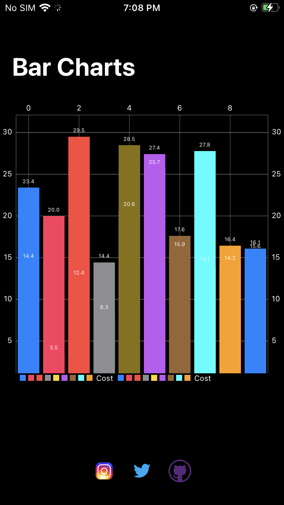

# Bar-Charts

**Bar Charts** app is using Autolayout (programmatically - without Storyboard) in **Swift 5.0+** and It can be built by *Xcode 11.0* or later. Compatible with *iOS 13.0/14.0+*.

### Photos Sample



## Installation

I'm using **Charts** pod for making this simple project. Charts is available through [CocoaPods](https://cocoapods.org). To install it, simply add the following line to your Podfile:

### Cocoapods

```ruby
pod 'Charts'
```

# Communication and Contribution

- If you **need help**, open an issue and tag as `help wanted`.
- If you **found a bug**, open an issue and tag as `bug`.
- If you **want to contribute**, submit a pull request.
  - In order to submit a pull request, please fork this repo and submit a PR from your forked repo.
  - Have a detailed message as to what your PR fixes/enhances/adds.

## Requirements

In order to compile Bar Charts you will need to meet the following requirements:

* iOS 13.0+ / Mac OS X 10.14+
* Xcode 11.0+
* Swift 5.0+
